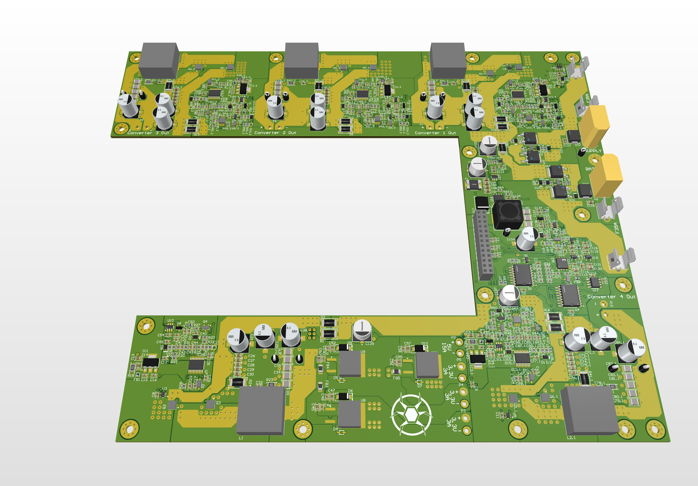
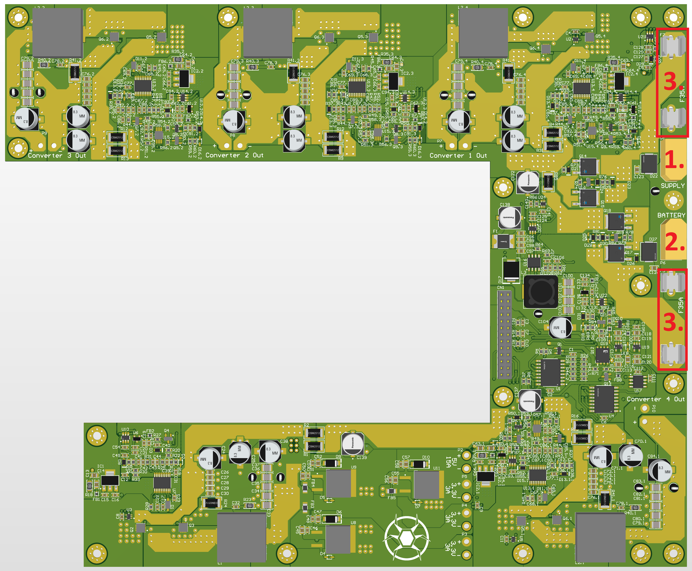
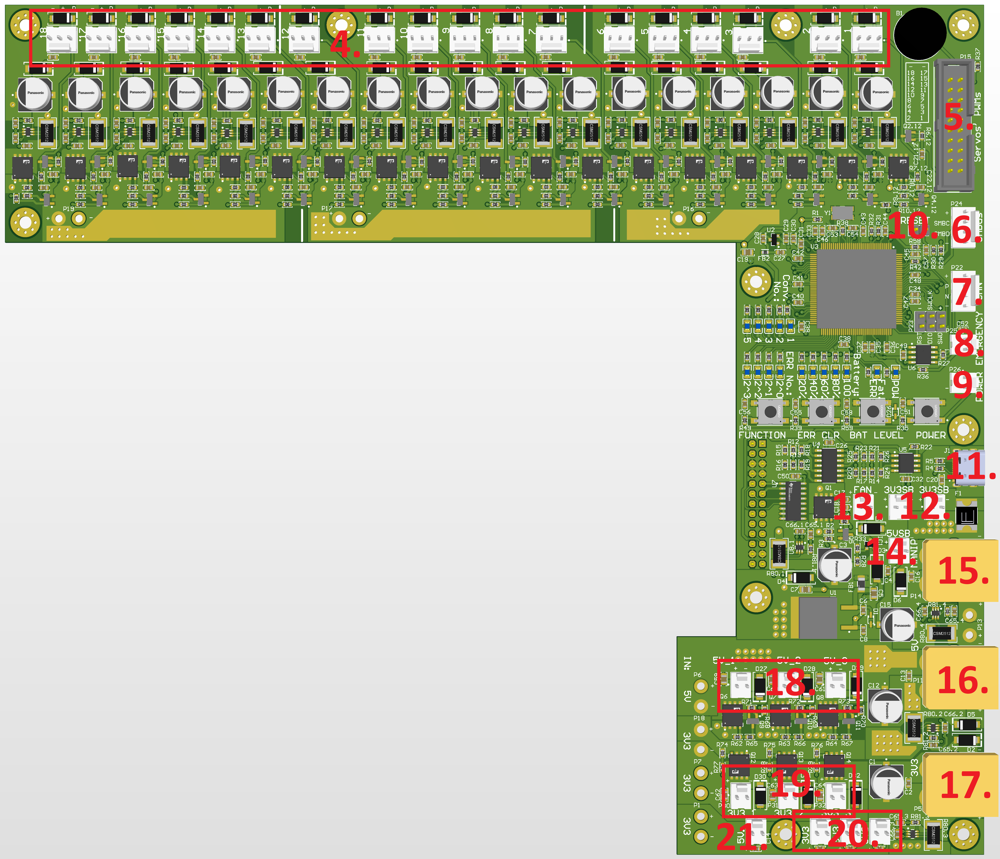

# Elkapod Power Supply
Elkapod Power Supply is a power supply for a hexapod walking robot built as part of the work in the Warsaw University of Technology Bionik science club. It provides power to 18 leg servos, electronics and peripherals.

---

The bottom PCB - Converter Module

---

The upper PCB -  Controller Module

## Design assumptions
The servos used in the project draw a maximum current of 3.5A according to the documentation. For this reason, the power supply should provide a current of around 60A. This power supply can be powered from an external mains power supply with a voltage of 11 to 18V, and from a lithium-ion battery with a similar voltage range. Therefore, it was decided to make 3 buck converters with a maximum current of 20A, which allow for tuning the output voltage in the range of 5.0-7.5V. Additionally, one 5V buck converter with a capacity of 15A was made to power the robot's electronics. The possibility of equipping the robot with an additional manipulator was also taken into account, by making an additional buck converter with a voltage regulated in the range of 5-9.5V and an output current of up to 20A. Additional requirements imposed on the power supply design were: measurement of the current of each servos, the ability to turn off the power supply of each servos separately, the use of logic level converters to control the servos using PWM from an external Elkapod Hardware Controller, additional controlled and uncontrolled 3.3V and 5V outputs, stand-by voltage outputs, voltage measurements, error status memory, communication with the battery pack using the SMBus protocol. All this is to be controlled from an external Elkapod Hardware Controller using the CAN bus.

The lower PCB contains 5 main converter sections, a stand-by converter and a power selector with reverse polarity protection implemented on MOSFET transistors.

The upper PCB contains circuits for measuring currents, controlling servos, a simple user interface based on buttons and LEDs and an STM32 microcontroller.

## Description of connectors

The lower PCB:

1. External power supply XT60 connector (11-18V, min. 35A);
2. Li-ion battery pack XT60 connector (4s configuration);
3. 35A 6.3x32mm fast fuses connectors;

---

The upper PCB:

4. 18 x servos connectors (5.0-7.5V; 3.5A);
5. IDC20 connector to control servos with PWM;
6. SMBus KK connector to control the battery li-ion pack;
7. CAN KK connector;
8. Emergency button KK connector (OFF-(ON) type);
9. Power button KK connector (OFF-(ON) type);
10. Reset goldpin jumper;
11. USB-C supply connector (5V; 5A);
12. 3.3V stand-by voltage KK connectors (sum of all 3.3V and 5V currents up to 2.5A);
13. Optional fan KK connector (5V; 100mA);
14. 5V stand-by voltage KK connector (sum of all 3.3V and 5V currents up to 2.5A);
15. Manipulator supply XT60 connector (5.0-9.5V; 20A);
16. 5V power out XT60 connector (up to 15A but sum of all 3.3V and 5V currents (except stand-by voltages) cannot exceed 15A);
17. 3.3V power out XT60 connector (3A);
18. 5V controllable (turn on and off via CAN bus) KK connectors (3 x 2.5A);
19. 3.3V controll controllable (turn on and off via CAN bus) KK connectors (3 x 2.5A but sum of all this currents cannot exceed 3A);
20. 3.3V KK connectors (3 x 2.5A but sum of all this currents cannot exceed 3A);
21. 5V KK connector;

## Safety information
The device is built exclusively from MOSFET transistors and integrated circuits in MOS technology, which makes it very sensitive to ESD (electrostatic discharge). All connectors are protected against ESD using Transil diodes, but this does not protect against damaging the board by touching it in other places. Therefore, it is forbidden to touch the power supply without appropriate anti-ESD protection.

